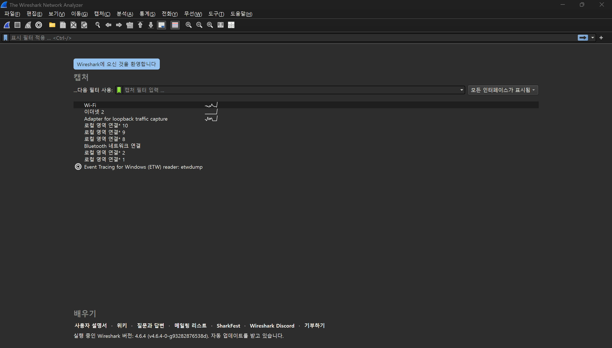

# 네트워크 기초 과제

### Wireshark

> Wireshark 툴을 관리자권한으로 실행시킨 뒤, WIFI 모드로 설정해 툴을 열었다.
> 

> 특정 프로토콜을 클릭하면 우측 하단에 해당 프로토콜에 대한 16비트 주소를 볼 수 있다.
> 

> 디스플레이 필터를 적용해 HTTP 필터를 걸어 패킷 분석에 불필요한 트래픽을 제거했다.
> 

> HTTPS 프로토콜은 *HTTP over Secure Socket Layer(최근엔 HTTP over TLS로 사용된다.)*의 약자로, SSL이나 TLS 암호화를 통해 보안을 강화하기 때문에, 패킷 캡처가 원활히 진행되도록 HTTP 프로토콜로 변경해 사이트에 접속해줬다.
> 

<aside>
💡

**SSL(Secure Sockets Layer)**

- 웹 브라우저와 서버 간의 데이터를 암호화하여 인터넷 연결을 보호하는 기술 표준
- 해커가 개인 데이터나 금융 데이터 등의 전송되는 정보를 보거나 훔치는 것을 방지
</aside>

<aside>
💡

**TLS(Transport Layer Security)**

- SSL의 취약점을 보완한 향상, 업그레이드 버전
- 인터넷 커뮤니케이션을 위한 개인 정보와 데이터 무결성을 제공하는 보안 프로토
</aside>

> 용인시 홈페이지에 접속해 2026년 모자보건사업 안내책자의 pdf 파일을 다운받았다.
> 

> 다시 Wireshark로 돌아왔을 때의 패킷 상태다. 모든 패킷이 초록색으로 떠있는 것을 보아 정상 문법으로 이루어져있음을 분석할 수 있다.
> 

> 캡처한 패킷을 저장하고 상단 툴바에서 통계 탭을 누른 뒤, HTTP → 패킷 카운터를 누르면 이렇게 HTTP 분석 상태를 볼 수 있다.
> 

> HTTP Request는 진행하지 않았기 때문에 HTTP Response Packet의 분석 코드만 살펴보면, 총 122개 중 121개의 패킷이 정상적으로 요청을 처리했고, 그 중 115개의 패킷은 200 ok, 나머지 6개의 패킷은 206 Partial Content의 형태로 요청 성공한 것을 알 수 있다. 206 코드는 PDF 파일을 다운 받는 과정에서 발생한 것으로 추정한다. PDF 파일 특성상 용량이 클 수 있기 때문에 브라우저가 이를 한 번에 받지 않고, 범위 요청을 통해 일부분씩 나눠 받는데, 이때 사용되는 코드가 206이다.
> 

> 남은 1개의 패킷 코드는 3xx, 즉 리다이렉션 코드로 302 Found인데, 이는 클라이언트가 요청한 URL이 일시적으로 다른 주소로 옮겨졌을 때 발생하는 경로 이동 코드로, 아마 HTTPS 프로토콜을 HTTP로 변경하면서 발생한 것으로 추정한다. 나머지 4xx, 5xx은 존재하지 않는 것으로 보아 통신 서버나 서버와 클라이언트 간의 설정 오류 및 권한 문제는 발생하지 않았음을 알 수 있다. 즉, 통신 무결성이 검증된 셈이다.
>