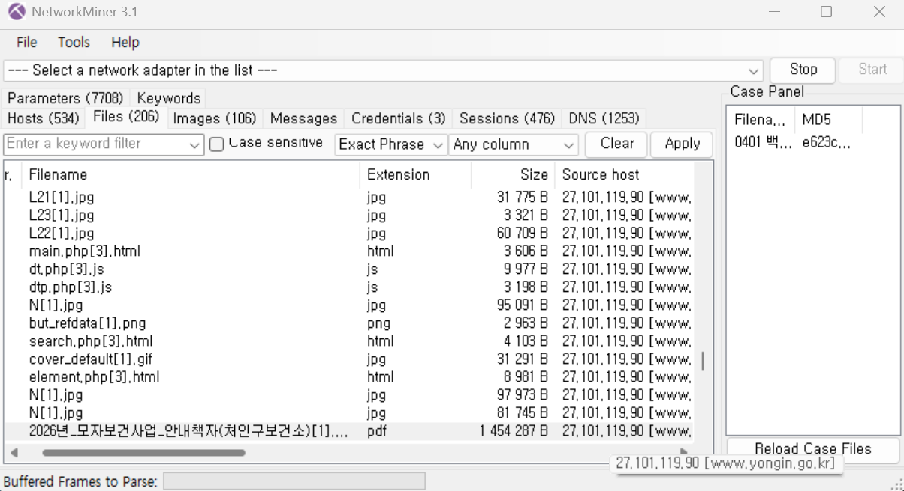

# 1. 기본 분석

- 사용된 프로토콜을 3가지 이상 작성하시오.
  HTTP,TCP,IP

# 2. 웹 요청 분석

- HTTP 요청 중 ".pdf" 파일을 다운로드하는 요청을 찾으시오.

- 전체 URL (http:// 포함)을 작성하시오.
  http://www.yongin.go.kr/ebook/src/viewer/download.php?host=main&site=20260227_091734&no=1

- 요청 방식(GET/POST)을 작성하시오.
  GET

# 3. 서버 응답 분석

- 서버가 반환한 파일의 종류는 무엇인가?
  PDF
- 파일 크기는 얼마인가?
  1454287B
- 파일 이름은 무엇인가?
  2026*모자보건사업*안내책자(처인구보건소)

# 4. 파일 복구

- NetworkMiner를 사용하여 파일을 복구하고, 복구 과정을 단계별로 작성하시오.
  Wireshark에서 저장해 둔 캡처 파일을 열고 필터 창에 http 입력 후 적용한다. 패킷 목록에서 pdf 요청 패킷을 찾고 open file하여 파일을 복구한다.
- 복구 과정 화면을 캡처하여 첨부하시오.
  
