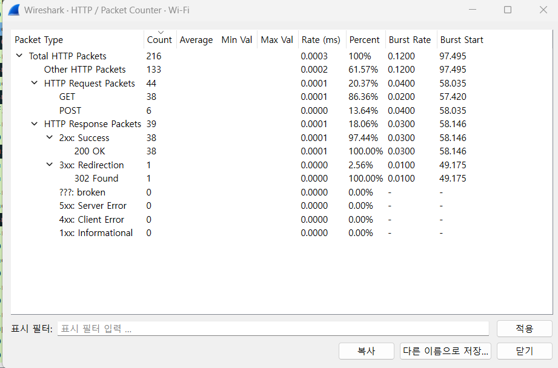
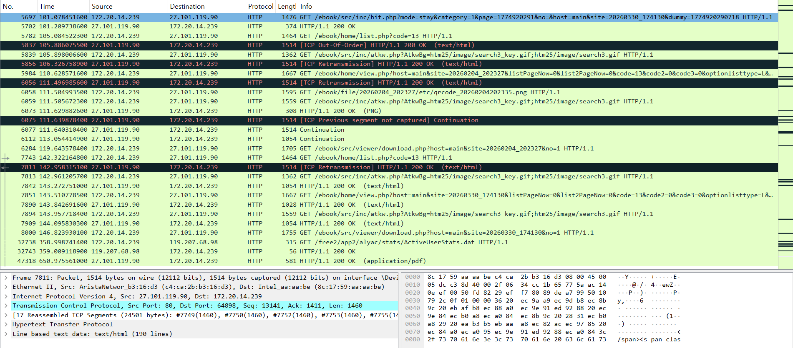

# 과제
- week02 파일 안에 본인 이름 파일을 만든 후 그 안에 제출.

## Wireshark 심화

### 제출 파일
- Wireshark 패킷 캡처 파일 (`.pcapng`)
- 결과 정리 파일 (`.md` 또는 `.txt`)

### 목표
- Wireshark를 이용하여 PDF 파일 다운로드 패킷 캡처
- HTTP 상태 코드 분석

### 실습 과정
1. Wireshark 실행
2. 패킷 캡처 시작
3. 디스플레이 필터에 `HTTP` 설정
4. 용인시 홈페이지 접속  
 (https → http로 변경하여 암호화 해제)
5. 홈페이지에서 PDF 파일 다운로드  
 (다운로드 전체 과정 패킷 캡처)
 - http 환경에서는 경고창이 뜨면 "계속" 클릭
6. 패킷 캡처 종료 후 저장

### 분석 내용
- `통계 → HTTP → Packet Counter → HTTP Response Packets`
- 주요 상태 코드(200, 301, 404 등) 확인 및 의미 간단히 정리

### 결과 정리 (필수)
# Week02 Wireshark HTTP Packet Analysis

## 1. 실습 환경
- Wireshark를 이용하여 HTTP 패킷 캡처를 진행하였다.
- Wi-Fi 인터페이스를 선택하여 네트워크 트래픽을 수집하였다.

## 2. 실습 과정

### (1) 캡처 시작
Wireshark 실행 후 Wi-Fi 인터페이스를 선택하여 패킷 캡처를 시작하였다.

### (2) 디스플레이 필터 설정
HTTP 패킷만 확인하기 위해 다음과 같은 필터를 적용하였다.

### (3) 사이트 접속 및 HTTPS → HTTP 전환
기본적으로 웹은 HTTPS를 사용하기 때문에 패킷 내용 확인이 어렵다.  
따라서 URL에서 HTTPS를 HTTP로 변경하여 패킷 내용을 확인할 수 있도록 하였다.

### (4) PDF 파일 다운로드
웹사이트에서 PDF 파일을 다운로드하였다.  
이 과정에서 보안 경고창이 발생하였으며, 계속 진행하여 다운로드를 수행하였다.

## 3. 패킷 캡처 결과

### (1) HTTP 패킷 통계

- Total HTTP Packets: 216개
- HTTP Request Packets: 44개
- HTTP Response Packets: 39개

---

### (2) 패킷 상세 캡처 화면

- GET 요청을 통해 웹 리소스를 요청하는 것을 확인하였다.
- 서버는 이에 대해 HTTP 응답을 반환하였다.
- 일부 패킷에서는 TCP 재전송(Retransmission) 및 순서 오류(Out-of-Order)가 발생한 것을 확인할 수 있었다.

## 4. 상태 코드 분석

- 2xx (Success)  
  - 200 OK: 정상적으로 요청이 처리됨

- 3xx (Redirection) 
  - 302 Found: 리다이렉션 발생

- 4xx, 5xx 
  - 오류 응답은 발생하지 않음

→ 대부분의 요청이 정상적으로 처리되었음을 확인하였다.

## 5. 추가 분석

- HTTP는 포트 80을 사용한다.
- HTTPS는 포트 443을 사용한다.
- 리다이렉션(302)은 HTTPS → HTTP 전환 과정에서 발생한 것으로 보인다.
- 일부 TCP 재전송 패킷이 존재하는 것으로 보아 네트워크 상태가 완전히 안정적이지 않을 가능성이 있다.
## 6. 결론

이번 실습을 통해 HTTP 통신 구조와 패킷 흐름을 직접 확인할 수 있었다.  
특히 요청(GET)과 응답(200 OK)의 관계, 그리고 리다이렉션(302)의 발생 과정을 이해할 수 있었다.  
또한 TCP 재전송과 같은 네트워크 특성도 함께 관찰할 수 있었다.
