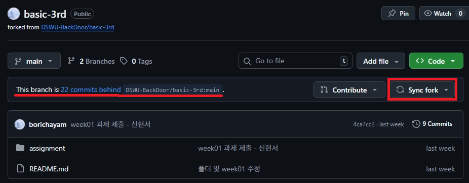
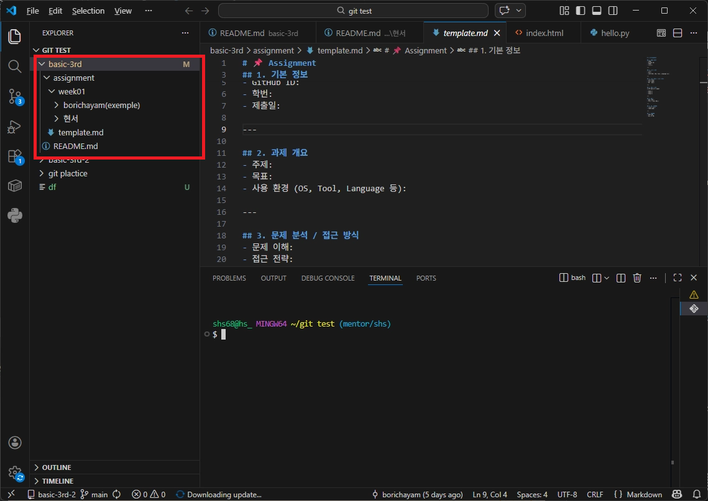
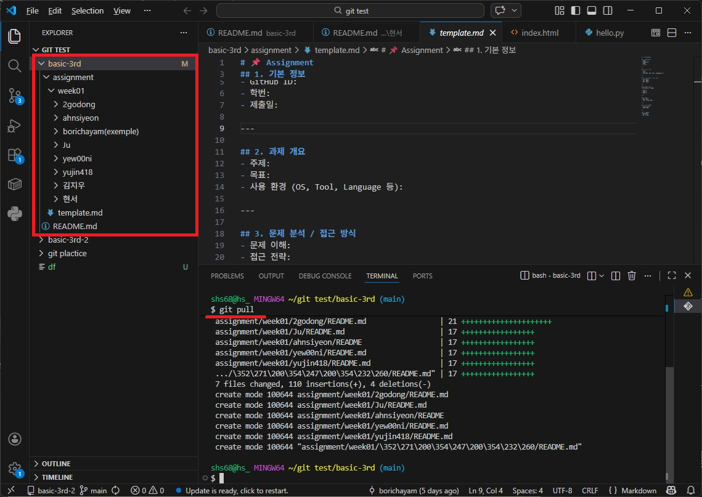

## 왜 필요한가?

GitHub에서 fork한 저장소는 **원본 저장소와 자동으로 동기화되지 않습니다.**

```
원본 repo (BackDoor)
   ↑ 업데이트 발생
내 fork repo ❌ 자동 반영 안 됨
```

그래서 직접 최신 내용을 가져와야 합니다.

---

# 1️⃣ GitHub에서 최신 내용 가져오기 (Sync fork)

1. 본인의 fork 레포로 이동
(예: `github.com/내아이디/basic-3rd`)
2. 상단에서 아래와 같은 메시지 확인
    
    ```
    This branch is behind DSWU-BackDoor:main
    ```
    
3. **Sync fork 버튼 클릭**
    
    
    
4. **Update branch 클릭**

## 결과

```
원본 repo → 내 fork repo 동기화 완료
```

→ 이제 GitHub 상의 내 레포는 최신 상태

---

# 2️⃣ 내 컴퓨터에 반영하기 (git pull)

GitHub에서 최신화 했더라도

→ 내 컴퓨터는 여전히 옛날 상태입니다.



## 명령어

```
git pull origin (브랜치명)
```

또는

```
git pull
```

(이미 origin 연결되어 있는 경우)

## 결과



```
내 fork repo → 내 PC 동기화 완료
```

---

# 전체 흐름 정리

```
원본 repo
   ↓
Sync fork (GitHub)
   ↓
내 fork repo (최신 상태)
   ↓
git pull (터미널)
   ↓
내 PC (최신 상태)
```

---

# ❗ 주의사항

## 1️⃣ clone은 한 번만

```
clone = 처음 1번만
pull = 계속 업데이트
```

→ 다시 clone ❌

## 2️⃣ GitHub와 내 PC는 별개

```
GitHub 최신화 ≠ 내 PC 최신화
```

→ 반드시 `git pull` 해야 반영됨